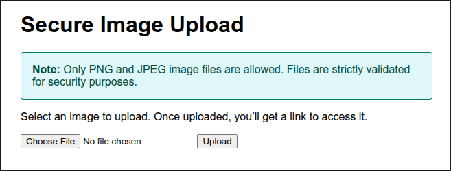

# HackingLab-FS25

A simple hacking lab designed to teach students the critical importance of backend validation and to demonstrate that frontend checks alone are insufficient.  
This lab is part of a coursework submission for the FS25 module "Hacking Lab" at the Eastern Switzerland University of Applied Sciences (OST).



## Instructions

1. Navigate to the root directory of the repository.  
2. Run the following command to build and start the Docker containers:  
   ```bash
   docker-compose up --build
   ```
3. Open your browser and visit: [http://localhost:8080](http://localhost:8080)

4. For the task description, refer to the `TASK.md` file located in the root directory.

5. The solution can be found in `/solution/SOLUTION.md`.